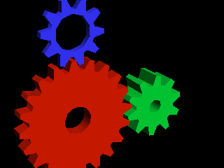

# TinyGL



This is an extension of [Fabrice Bellard's TinyGL](https://bellard.org/TinyGL/) project.

TinyGL is an implementation of the OpenGL 1.2 specification in pure software, using no hardware acceleration. It is designed to be lightweight and fast, using highly optimized rasterization routines originally written by [Fabrice Bellard](https://bellard.org).

The minimum requirements to compile & run this code is ISO C99 compliance and a 32-bit processor respectively.

TinyGL can also be installed as a system-wide library and then accessed with `pkg-config`.

The original versions (in `.tar.gz` format) can be found in the `archive` folder.

## Examples

- [`bounce.c`](./examples/bounce.c) - Bouncing ball demo by Brian Paul
- [`cube.c`](./examples/cube.c) - glDrawElements example by erysdren
- [`gears.c`](./examples/gears.c) - Gears demo by Brian Paul
- [`mech.c`](./examples/mech.c) - glutmech by Simon Parkinson-Bates
- [`spin.c`](./examples/spin.c) - Spinning box demo by Brian Paul
- [`texobj.c`](./examples/texobj.c) - Textured object demo by Brian Paul
- [`ui_headless.c`](./examples/ui_headless.c) - TinyGL with `stb_image_write` by erysdren
- [`ui_sdl2.c`](./examples/ui_sdl2.c) - TinyGL with SDL2 by erysdren
- [`ui_sdl3.c`](./examples/ui_sdl3.c) - TinyGL with SDL3 by erysdren

## TODO

- [ ] More multithreading friendly
- [ ] Import more demos and examples, like from Mesa3D or Haiku
- [ ] Remove stdlib assert() calls
- [ ] Allow user to set custom allocator
- [ ] Update SDL2 and SDL3 demos to work on Windows (see [#1](https://github.com/erysdren/TinyGL/issues/1))

## Thirdparty

- [`stb_image_write.h`](https://github.com/nothings/stb/)

## Platforms

TinyGL has been tested with Clang, GCC, TinyCC, and Open Watcom. The following platforms have also been tested:

- Linux
- Windows
- Haiku
- MS-DOS
- OS/2

## Building

TinyGL is built via CMake.

```
git clone https://github.com/erysdren/TinyGL
cd TinyGL
cmake -Bbuild -S.
cmake --build build
```

## License

MIT License

Copyright (c) 1997-2022 Fabrice Bellard\
Copyright (c) 2023-2025 erysdren (it/its)

Permission is hereby granted, free of charge, to any person obtaining a copy
of this software and associated documentation files (the "Software"), to deal
in the Software without restriction, including without limitation the rights
to use, copy, modify, merge, publish, distribute, sublicense, and/or sell
copies of the Software, and to permit persons to whom the Software is
furnished to do so, subject to the following conditions:

The above copyright notice and this permission notice shall be included in all
copies or substantial portions of the Software.

THE SOFTWARE IS PROVIDED "AS IS", WITHOUT WARRANTY OF ANY KIND, EXPRESS OR
IMPLIED, INCLUDING BUT NOT LIMITED TO THE WARRANTIES OF MERCHANTABILITY,
FITNESS FOR A PARTICULAR PURPOSE AND NONINFRINGEMENT. IN NO EVENT SHALL THE
AUTHORS OR COPYRIGHT HOLDERS BE LIABLE FOR ANY CLAIM, DAMAGES OR OTHER
LIABILITY, WHETHER IN AN ACTION OF CONTRACT, TORT OR OTHERWISE, ARISING FROM,
OUT OF OR IN CONNECTION WITH THE SOFTWARE OR THE USE OR OTHER DEALINGS IN THE
SOFTWARE.
